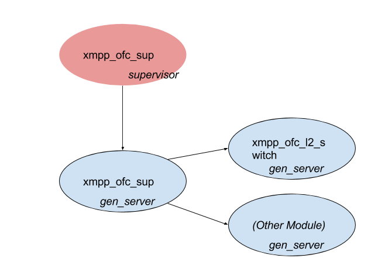
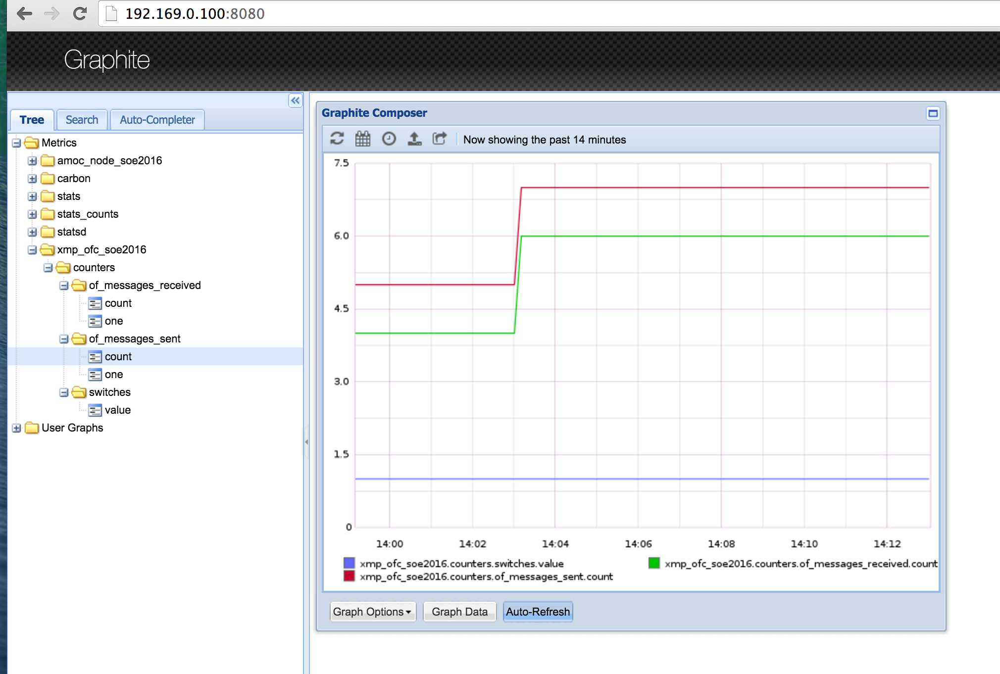

# xmpp_ofc - XMPP Controller


<!-- markdown-toc start - Don't edit this section. Run M-x markdown-toc-generate-toc again -->
**Table of Contents**

- [xmpp_ofc - XMPP Controller](#xmppofc---xmpp-controller)
    - [References](#references)
        - [OTP](#otp)
        - [OpenFlow](#openflow)
    - [Architecture](#architecture)
        - [xmpp_ofsh](#xmpp_ofsh)
            - [API](#api)
            - [Functionalities](#functionalities)
        - [xmpp_ofc_gen_switch](#xmpp_ofc_gen_switch)
            - [API](#api)
            - [Functionalities](#functionalities)
        - [Controller Modules](#controller-modules)
            - [API](#api)
            - [Description](#description)
            - [Implementation of an example Controller Module](#implementation-of-an-example-controller-module)
                - [MAC-Learning switch algorithm](#mac-learning-switch-algorithm)
                - [Starting the Module](#starting-the-module)
                - [Handling a message](#handling-a-message)
    - [Sequence Diagrams](#sequence-diagrams)
        - [Switch Connection](#switch-connection)
        - [OpenFlow message from a switch](#openflow-message-from-a-switch)
    - [Walthrough](#walthrough)
        - [Check the swtich forwarding table](#check-the-swtich-forwarding-table)
        - [Verify the number of session in the MIM server](#verify-the-number-of-session-in-the-mim-server)
        - [Clone the controller, and install it](#clone-the-controller-and-install-it)
        - [See the switch forwarding table](#see-the-switch-forwarding-table)
        - [See the stats of the controller in graphite](#see-the-stats-of-the-controller-in-graphite)
    - [Task: Simple Intrusion Detections System (Simple IDS)](#task-simple-intrusion-detections-system-simple-ids)
        - [Assumptions](#assumptions)
        - [Sequence diagram](#sequence-diagram)
        - [TODO](#todo)

<!-- markdown-toc end -->


## Running
Invoke `make shell` to start.

Invoke `make ct` to run tests.

## References ##

#### General Erlang ####

* [Offical Erlang Documentation](http://www.erlang.org/doc/)
* [Erlang Reference Manual User's Guide](http://www.erlang.org/doc/reference_manual/users_guide.html)
* [Getting Started with Erlang User's Guide](http://www.erlang.org/doc/getting_started/users_guide.html)
* [Learn You Some Erlang](http://learnyousomeerlang.com/content)

#### OTP ####

* [gen_server behaviour](http://erlang.org/doc/design_principles/gen_server_concepts.html)
* [supervisor behaviour](http://erlang.org/doc/design_principles/sup_princ.html)
* [application behaviour](http://erlang.org/doc/design_principles/applications.html)

### OpenFlow ###

* http://flowgrammable.org/
* [OpenFlow Specifications](https://www.opennetworking.org/sdn-resources/technical-library)
  * we're interested in 1.3.x

## Architecture ##



### xmpp_ofsh

`ofsh` stands for OpenFlow Switch handler. It's a callback module called by one of the libraries of the LOOM controller: `ofs_handler`. It is configured in the [sys.config file](config/sys.conifg):

```erlang
...
 {ofs_handler,[
               {callback_module,xmpp_ofc_ofsh}, %% <--- HERE
               {peer,"localhost"},
               {callback_opts,[]}
              ]},
...
```

#### API

```erlang
@doc Called whenever a new switch connects to the controller
init(Mode, Ip, DatapathId, Features, Version, Connection, Options) -> {ok, SwitchState}.

@doc Called when a switch sends a message to the controller that it subscribed to
handle_message(Msg, SwitchState) -> ok.

@doc Called when a switch disconnects from the controller.
terminate(SwitchState) -> ok.
```

#### Functionalities

This module connects the LOOM library with the logic implemented in the rest of the modules.

### xmpp_ofc_gen_switch

#### API

```erlang

%% starts the process
start_link() -> {ok, pid()} 

%% called when a new switch with given DatapathId connects
open_connection(DatapathId) -> ok

%% called when a switch with given DatapathId disconnects
terminate_connection(DatapathId) -> ok.

%% called when there's a message from a switch that that some module subscribed to
handle_message(DatapathId, Msg) -> ok.
```

#### Functionalities

* Starts the modules that will implement the logic
* Keeps the runtime configuration for the switches (enabled modules, pid's under witch they run, subscriptions)
* References the LOOM libraries for handling OpenFlow messages
```erlang
subscribe(DatapathId, MsgTypes) ->
    lists:foreach(
      fun(MsgType) ->
              ofs_handler:subscribe(DatapathId,xmpp_ofc_ofsh, MsgType) 
      end, MsgTypes).

....

unsubscribe(DatapathId, MsgTypes) ->
    lists:foreach(
      fun(MsgType) ->
              case ofs_handler:unsubscribe(DatapathId, xmpp_ofc_ofsh,
                                           MsgType) of
                  ok ->
                      ok;
                  no_handler ->
                      ok
              end
              end, MsgTypes).

....
of_send(DatapathId, Messages) ->
    exometer:update(?EXO_OF_MESSAGES_SENT, 1),
    [ofs_handler:send(DatapathId, M) || M <- Messages].
```

* When a message comes from a switch it passes it to the enabled moduels based on the subcriptions:

```erlang
handle_message(MsgType, Msg, ModsConfig) ->
    exometer:update(?EXO_OF_MESSAGES_RECEIVED, 1),
    lists:foldl(fun({Mod, Pid, MsgTypes}, Acc) ->
                        case lists:member(MsgType, MsgTypes) of
                            true ->
                                Mod:handle_message(Pid, Msg, Acc);
                            false ->
                                Acc
                        end
                end, [], ModsConfig).

```

* updates metrics that are sent to graphite


### Controller Modules

#### API

```erlang
%% Starts the module and returns its pid, subscriptions, and initial OpenFlow messages that are to be sent to the contoller
start_link(DatapathId) ->  {ok, Pid, subscriptions(), init_of_messages()}

%% Stops the module
stop(Pid) -> ok

%% Called when a meesage that this module have subscribed to is received by the controller
%% Pid is the module Pid, the Msg is the message that was delivered and the OFMessages is a list of all the OpenFlow messages that are going to be sent to the controller and that were returned from the other modules.
%% This functions is epxected to return the updated list of the OpenFlow messages.
-spec handle_message(pid(),
                     {MsgType :: term(),
                      Xid :: term(),
                      MsgBody :: [tuple()]},
                     [ofp_message()]) -> [ofp_message()].
handle_message(Pid, Msg, OFMessages) -> [UpdatedOFMessage]

```

#### Description

* A controller module provides a set of functionality to be applied on the network
* It subscribes to the messages from the switch (like packet-in)
* When a messages that it has subscribed to is received by the controller it is passed to the Module's `handle_message/4` callback which in turn adds OpenFlow messages to be sent down to the switch
* `xmpp_ofc_l2_switch` is a module implementing basic MAC-learning switch functionality
   * it subscribes to `PacketIn` messages
   * on receiving such message it builds up a forwarding table and send appropriate `FlowMods` down to the switch
```erlang
flow_to_dst_mac(PacketIn, OutPort) ->
    [InPort, DstMac] = packet_in_extract([in_port, dst_mac], PacketIn),
    Matches = [{in_port, InPort}, {eth_dst, DstMac}],
    Instructions = [{apply_actions, [{output, OutPort, no_buffer}]}],
    FlowOpts = [{table_id, 0}, {priority, 100},
                {idle_timeout, ?FM_TIMEOUT_S(idle)},
                {hard_timeout, ?FM_TIMEOUT_S(hard)},
                {cookie, <<0,0,0,0,0,0,0,10>>},
                {cookie_mask, <<0,0,0,0,0,0,0,0>>}],
    of_msg_lib:flow_add(?OF_VER, Matches, Instructions, FlowOpts).

```

#### Implementation of an example Controller Module

This section explains how to implement a Controller Module based on the `xmpp_ofc_l2_switch` which provides the simple MAC-learning switch functionality.

> NOTE: The Controller Module is an Erlang Module that satisfies the API described in the previous section. It's a piece of software that provides certain set of functionality to the system.

##### MAC-Learning switch algorithm

The example Controller Module  follows the algorithm presented below:


##### Starting the Module

```erlang
start_link(DatapathId) ->
    {ok, Pid} = gen_server:start_link(?MODULE, [DatapathId], []),
    {ok, Pid, subscriptions(), [init_flow_mod()]}.
```

The `xmpp_ofc_l2_switch` is a `gen_server`. The `subscriptions/0` returns a list with an atom `packet_in` which means that this Module wants to be notified about all the `PacketIn` messages sent from the switch with the `DatapathId`.

The fourth element of the `start_link/1` return tuple is an one-element list. It contains the `FlowMod` that will be sent down to the switch from the controller.

```erlang
init_flow_mod() ->
    Matches = [],
    Instructions = [{apply_actions, [{output, controller, no_buffer}]}],
    FlowOpts = [{table_id, 0}, {priority, 10},
                {idle_timeout, 0},
                {hard_timeout, 0},
                {cookie, <<0,0,0,0,0,0,0,1>>},
                {cookie_mask, <<0,0,0,0,0,0,0,0>>}],
    of_msg_lib:flow_add(?OF_VER, Matches, Instructions, FlowOpts).
```
This `FlowMod` will result in a `FlowEntry` being installed in the switch that:
* will match any incoming packet - because the `Matches` is an empty list which wildcards all the headers in a packet
* will be installed in the table number 0
* will be in the switch forever (`idle_timeout` and `hard_timeout`)
* will have the priority of 10 (an incoming packet will be tried to match a `FlowEntry` with the highest priority first; once a entry is matched its actions are executed and no more `FlowEntries` are checked)
* will send the matching packets to the controller (`no_buffer` indicates the the whole original packet will be included in the `PacketIn` message)

> Check the [OpenFlow documentation](https://www.opennetworking.org/images/stories/downloads/sdn-resources/onf-specifications/openflow/openflow-spec-v1.3.2.pdf) for more information, especially,
> 5.1, 5.2, 5.3, 5.4 and 7.3.4.1.

Because the `xmpp_ofc_l2_switch` is a `gen_server` it initiates its state in the `init/1`:

```erlang
init([DatapathId]) ->
    {ok, #state{datapath_id = DatapathId, fwd_table = #{}}}.
```

The state keeps track of the `DatapathId` and forwarding table `fwd_table` which is simply a map that maps MAC addresses to ports they occur on.

##### Handling a message

```erlang
handle_call({handle_message, {packet_in, _, MsgBody} = Msg, CurrOFMesssages},
            _From, #state{datapath_id = Dpid,
                          fwd_table = FwdTable0} = State) ->
    case packet_in_extract(reason, MsgBody) of
        action ->
            {OFMessages, FwdTable1} = handle_packet_in(Msg, Dpid, FwdTable0),
            {reply, OFMessages ++ CurrOFMesssages,
             State#state{fwd_table = FwdTable1}};
        _ ->
            {reply, CurrOFMesssages, State}
    end.
```

The `PacketIn` message that is passed from the LOOM has the following format:
```erlang
{packet_in, Xid, Body}
```
where the `Xid` is the message identifier and the body is a property list:

```erlang
-type packet_in() :: list(packet_in_property()).

-type packet_in_property() :: {buffer_id,  ofp_buffer_id()} |
                              {reason, ofp_packet_in_reason()} |
                              {table_id, non_neg_integer()} |
                              {cookie, binary()} | 
                              {match, match()} |
                              {data, binary()}.
```

> You can find out more on the `PacketIn` message in the 7.4.1 of [OpenFlow documentation](https://www.opennetworking.org/images/stories/downloads/sdn-resources/onf-specifications/openflow/openflow-spec-v1.3.2.pdf).

What is interesting for us is the `reason` which says why the `PacketIn` message was sent from the switch. In our case, the reason is `action` which means that the message was triggered as a result of an action in the `FlowEntry` - the one installed in the switch just after the Module started (the *initial* `FlowMod`). Apart from that, we will have to look into the `data` field that contains the original packet. It is because of the following:
* we want to learn the source MAC-address -> Port Number mapping;
* we need to extract the destination MAC-address to see whether we know where to send the packet. All this is accomplished in the `handle_packet_in/3` function:

```erlang
handle_packet_in({_, Xid, PacketIn}, DatapathId, FwdTable0) ->
    FwdTable1  = learn_src_mac_to_port(PacketIn, DatapathId, FwdTable0),
    case get_port_for_dst_mac(PacketIn, FwdTable0) of
        undefined ->
            {[packet_out(Xid, PacketIn, flood)], FwdTable1};
        PortNo ->
            {[flow_to_dst_mac(PacketIn, PortNo),
              packet_out(Xid, PacketIn, PortNo)],
             FwdTable1}
    end.
```

According to the algorithm presented in the previous section, if the port for the destination MAC address is unknown we create a  `PacketOut` message that tells the switch to send the packet from the `PacketIn` out the special port: `flood`. The `flood` port basically tells the switch the send the packet out of all the ports apart from the source one.

However, if the destination port is known, the switch constructs the `FlowMod` so that `FlowEntry` is installed in the switch and all the subsequent packets in the traffic flow will be served according to it. What's more, the `PacketOut` message is sent too so that the first packet of this flow (the one from the `PacketIn`) is served as well.

The `FlowMod` that is sent down to the switch looks like the one below:
```erlang
flow_to_dst_mac(PacketIn, OutPort) ->
    [InPort, DstMac] = packet_in_extract([in_port, dst_mac], PacketIn),
    Matches = [{in_port, InPort}, {eth_dst, DstMac}],
    Instructions = [{apply_actions, [{output, OutPort, no_buffer}]}],
    FlowOpts = [{table_id, 0}, {priority, 100},
                {idle_timeout, ?FM_TIMEOUT_S(idle)},
                {idle_timeout, ?FM_TIMEOUT_S(hard)},
                {cookie, <<0,0,0,0,0,0,0,10>>},
                {cookie_mask, <<0,0,0,0,0,0,0,0>>}],
    of_msg_lib:flow_add(?OF_VER, Matches, Instructions, FlowOpts).
```

What is important here is that this `FlowMod` creates an entry that will match all the packets arriving at the `InPort` destined to the `DstMac` address (that we learnt from the `PacketIn` message). We also set timers this time so that the entry is deleted after some time (in the switch, but we also schedule removal of the MAC address -> Port Number mapping in the controller - see `learn_src_mac_to_port/3`). And the last important thing is that we set the priority to 100 which is higher than what we have in the initial `FlowMod`.

Finally, when you look back what is returned from the `handle_packet_in/3`, it returns the updated forwarding table and OpenFlow messages that the Controller Module wants to be pushed down to the switch. These messages are merged with the ones produces by other Controller Modules (however, in our case the `xmpp_ofc_l2_switch` is the first one so there're no previous OpenFlow messages):

```erlang
...
{OFMessages, FwdTable1} = handle_packet_in(Msg, Dpid, FwdTable0),
{reply, OFMessages ++ CurrOFMesssages, State#state{fwd_table = FwdTable1}};
```


## Sequence Diagrams
### Switch Connection

[The diagram source](https://www.websequencediagrams.com/?lz=dGl0bGUgU3dpdGNoIENvbm5lY3Rpb24KCnBhcnRpY2lwYW50IExPT00ABA1vZnNoABUNZ2VuX3MAPwZhcyAABAYANg1DVFJMXG5NT0QgYXMgQ00KCm5vdGUgb3ZlcgBZBSwATgUsADMHLCBDTToKKgBzBSBpcyB0aGUgT3BlbkZsb3cgY29udHJvbGxlciBmcmFtZXdvcmsKKgAfBSJ4bXBwX29mY18iIHByZWZpeCBpcyBvbWl0dGVkIGZvciBjbGFyaXR5CiogVGhlAIEQBSBNT0QgcmVwcmVzZW50cyBhAFUMbW9kdWxlIGxpawBRDGwyAIFlByIKZW5kIG5vdGUAgUkHbGVmdCBvZgCCLAU6IGEgbmV3AIIGByBjAIJWBnMKCgCBUQUtPgCCQAU6IGluaXQvNwpvZnNoIC0-AII0Bzogb3Blbl8ALQdpb24oRGF0YXBhdGhJZCkgW2FzeW5jXQAtBy0-AGgHe29rLACDQwdTdGF0ZX0KCmxvb3AAgl8GYWxsAIJCBWVuYWJsZWQAgVMHcwogICAAgRoILT4gQ006IHN0YXJ0X2xpbmsAbwYAbwUAIwVDTQBpBQCBGwhQaWRcbk9GTWVzc2FnZXNUb1N1YnNjcmliZVRvXG5Jbml0aWFsABYKAGYFAINsCgCDXgwgICAgV2hlbiBhIEMAg1QKTQCBHQYAgQsGcwoAgkgHcHJvY2VzcyBpcyBjcmVhdGVkLiBJdCByZXR1cm4AgUoGAIQiDW0AgRgHIHR5cGVzIHRoYXQAgXAFaXQgd2FudHMgdG8gc3ViAIEzBSB0byBhbmQAhGsFaQCBOgYAghwFADoTaGF0ADoJAG8GbyBzZW5kIHRvAIUqBQCFfAcgICAgAIQbCWVuZACDBwwAIgUAgi0GcHRpb24AgQYFT0YAgSgKZnJvbQCFdwUAggMHAIMeDwCEXwYAOwdiZQCEGAssIACGAAkAhlEGT0ZNc2dUeXBlKQBxFGluaXRhbABIM2VuZABpDQBiBQBcBwCESwoAhUsIc3RvcmUAh0cFY29uZmlndXJhdGlvblxub2YAh10FAINpElxuW05hbWUsIFBpZCwgAIRWCWQAgUoFc10K&s=roundgreen)

![alt](https://www.websequencediagrams.com/cgi-bin/cdraw?lz=dGl0bGUgU3dpdGNoIENvbm5lY3Rpb24KCnBhcnRpY2lwYW50IExPT00ABA1vZnNoABUNZ2VuX3MAPwZhcyAABAYANg1DVFJMXG5NT0QgYXMgQ00KCm5vdGUgb3ZlcgBZBSwATgUsADMHLCBDTToKKgBzBSBpcyB0aGUgT3BlbkZsb3cgY29udHJvbGxlciBmcmFtZXdvcmsKKgAfBSJ4bXBwX29mY18iIHByZWZpeCBpcyBvbWl0dGVkIGZvciBjbGFyaXR5CiogVGhlAIEQBSBNT0QgcmVwcmVzZW50cyBhAFUMbW9kdWxlIGxpawBRDGwyAIFlByIKZW5kIG5vdGUAgUkHbGVmdCBvZgCCLAU6IGEgbmV3AIIGByBjAIJWBnMKCgCBUQUtPgCCQAU6IGluaXQvNwpvZnNoIC0-AII0Bzogb3Blbl8ALQdpb24oRGF0YXBhdGhJZCkgW2FzeW5jXQAtBy0-AGgHe29rLACDQwdTdGF0ZX0KCmxvb3AAgl8GYWxsAIJCBWVuYWJsZWQAgVMHcwogICAAgRoILT4gQ006IHN0YXJ0X2xpbmsAbwYAbwUAIwVDTQBpBQCBGwhQaWRcbk9GTWVzc2FnZXNUb1N1YnNjcmliZVRvXG5Jbml0aWFsABYKAGYFAINsCgCDXgwgICAgV2hlbiBhIEMAg1QKTQCBHQYAgQsGcwoAgkgHcHJvY2VzcyBpcyBjcmVhdGVkLiBJdCByZXR1cm4AgUoGAIQiDW0AgRgHIHR5cGVzIHRoYXQAgXAFaXQgd2FudHMgdG8gc3ViAIEzBSB0byBhbmQAhGsFaQCBOgYAghwFADoTaGF0ADoJAG8GbyBzZW5kIHRvAIUqBQCFfAcgICAgAIQbCWVuZACDBwwAIgUAgi0GcHRpb24AgQYFT0YAgSgKZnJvbQCFdwUAggMHAIMeDwCEXwYAOwdiZQCEGAssIACGAAkAhlEGT0ZNc2dUeXBlKQBxFGluaXRhbABIM2VuZABpDQBiBQBcBwCESwoAhUsIc3RvcmUAh0cFY29uZmlndXJhdGlvblxub2YAh10FAINpElxuW05hbWUsIFBpZCwgAIRWCWQAgUoFc10K&s=roundgreen)

### OpenFlow message from a switch

[The diagram source](https://www.websequencediagrams.com/?lz=dGl0bGUgT3BlbkZsb3cgbWVzc2FnZSBmcm9tIGEgc3dpdGNoCgpwYXJ0aWNpcGFudCBMT09NAAQNb2ZzaAAVDWdlbl8ANAYgYXMAPAgANwxDVFJMXG5NT0QgYXMgQ00KCm5vdGUgb3ZlcgBZBSwATgUsAHcHLCBDTToKKgBzBSBpcyB0aACBJQtjb250cm9sbGVyIGZyYW1ld29yawoqAB8FInhtcHBfb2ZjXyIgcHJlZml4IGlzIG9taXR0ZWQgZm9yIGNsYXJpdHkKKiBUaGUAgRAFIE1PRCByZXByZXNlbnRzIGEAVQxtb2R1bGUgbGlrAFEMbDIAgWUHIgplbmQgbm90ZQCBQBA6IAphAIJSCCwgdGhhdCBvbmUKb2YAgUcFQwCBOQpNAF0FcwpoYWQgc3Vic2NyaWJlZCB0bywKaXMgcmVjZWl2ZWQgYnkAggcGAIFoCgBwCgCCIQUtPgCDEAU6IGhhbmRsZV8Ag08HKFxuTXNnLCBTAINRBVN0YXRlKQpvZnNoIC0-AINkBwAiEURhdGFwYXRoSWQsIE1zZylcblthc3luY10AMgctPgCBXAdvawoKAINuBwBDC2N0cmxfbW9kc19jb25maWcARQspACYJAHMLTW9kc0MAJQVzAIQKCwCBFAgKcmV0cmlldmUAgiEYAF8GdXJhdGlvbgCDXwV0aGUAhT4IAIJ0BXNlbnQAhD4FAIVjBwCDKgsKCmxvb3AAhQEGYWxsAIRkBWVuYWJsZWQAg3UHcwBDECAgICAKICAgAIYiBwCCPAxnZXRfAIF2CACBdQhcbk1vZCwAgVoLKQAwDQCCewtOYW1lLCBQaWRcblMAhAAJT0ZNAIcZBnMAbwpvcHQAhA8KT0YAhzgJaW4AhiQFACQZICAgAIUnBQCCVQwAhmQGABYIQQCCIgZiZWdpbm5pbmcAgkUGZXQANgkAhTkHAIgzCQBPEWlzIGVtcHR5IC0gZWFjaAApCACHKgoAgQEJAIJXCGFkZHMgaXRzIG1vZGlmaWMAg0MFAIEnCXdoZW4AhU0GaW5nIACGSgkAiSgFAIFMCQCDDw8gICAgAIcPCQCBcQgAhR4KQ00AhhQRUGlkLACGIgcAgmcKU2V0AIMmBiAgICBDTQCFJBBpZmkAgxMMU2V0AIQRBgCCRCJUaGUAgWYHAIMzDXMAgl0NaXMgcGFzc2VkAIoeBnRvAIoABW5leHQgQ00AgVEWZW5kAIUYBmVuZACFTQwAgwQFAIQWEgCBLg4gYnVpbHQgYnkAiRsGTQCEagYAh1QKAIlPBnNlbmQAiBMNT0ZNc2cpAGwGCgoK&s=roundgreen)

![alt](https://www.websequencediagrams.com/cgi-bin/cdraw?lz=dGl0bGUgT3BlbkZsb3cgbWVzc2FnZSBmcm9tIGEgc3dpdGNoCgpwYXJ0aWNpcGFudCBMT09NAAQNb2ZzaAAVDWdlbl8ANAYgYXMAPAgANwxDVFJMXG5NT0QgYXMgQ00KCm5vdGUgb3ZlcgBZBSwATgUsAHcHLCBDTToKKgBzBSBpcyB0aACBJQtjb250cm9sbGVyIGZyYW1ld29yawoqAB8FInhtcHBfb2ZjXyIgcHJlZml4IGlzIG9taXR0ZWQgZm9yIGNsYXJpdHkKKiBUaGUAgRAFIE1PRCByZXByZXNlbnRzIGEAVQxtb2R1bGUgbGlrAFEMbDIAgWUHIgplbmQgbm90ZQCBQBA6IAphAIJSCCwgdGhhdCBvbmUKb2YAgUcFQwCBOQpNAF0FcwpoYWQgc3Vic2NyaWJlZCB0bywKaXMgcmVjZWl2ZWQgYnkAggcGAIFoCgBwCgCCIQUtPgCDEAU6IGhhbmRsZV8Ag08HKFxuTXNnLCBTAINRBVN0YXRlKQpvZnNoIC0-AINkBwAiEURhdGFwYXRoSWQsIE1zZylcblthc3luY10AMgctPgCBXAdvawoKAINuBwBDC2N0cmxfbW9kc19jb25maWcARQspACYJAHMLTW9kc0MAJQVzAIQKCwCBFAgKcmV0cmlldmUAgiEYAF8GdXJhdGlvbgCDXwV0aGUAhT4IAIJ0BXNlbnQAhD4FAIVjBwCDKgsKCmxvb3AAhQEGYWxsAIRkBWVuYWJsZWQAg3UHcwBDECAgICAKICAgAIYiBwCCPAxnZXRfAIF2CACBdQhcbk1vZCwAgVoLKQAwDQCCewtOYW1lLCBQaWRcblMAhAAJT0ZNAIcZBnMAbwpvcHQAhA8KT0YAhzgJaW4AhiQFACQZICAgAIUnBQCCVQwAhmQGABYIQQCCIgZiZWdpbm5pbmcAgkUGZXQANgkAhTkHAIgzCQBPEWlzIGVtcHR5IC0gZWFjaAApCACHKgoAgQEJAIJXCGFkZHMgaXRzIG1vZGlmaWMAg0MFAIEnCXdoZW4AhU0GaW5nIACGSgkAiSgFAIFMCQCDDw8gICAgAIcPCQCBcQgAhR4KQ00AhhQRUGlkLACGIgcAgmcKU2V0AIMmBiAgICBDTQCFJBBpZmkAgxMMU2V0AIQRBgCCRCJUaGUAgWYHAIMzDXMAgl0NaXMgcGFzc2VkAIoeBnRvAIoABW5leHQgQ00AgVEWZW5kAIUYBmVuZACFTQwAgwQFAIQWEgCBLg4gYnVpbHQgYnkAiRsGTQCEagYAh1QKAIlPBnNlbmQAiBMNT0ZNc2cpAGwGCgoK&s=roundgreen)


## Walthrough

This walkthrough is based on the dedicated environment [2016.04_erlang_env](https://github.com/lambdaacademy/2016.04_erlang_env). After bringing this environment up and running, log into the VM (`vagrant ssh`) and run what is described in the **Sanity Check** paragraph. You should have **Amoc*, **MongooseIM** and **OVS** running. Then follow the steps below.

### Check the swtich forwarding table

```bash
vagrant@soe2016:~$ sudo ovs-ofctl dump-flows ovs-br1 -O OpenFlow13
OFPST_FLOW reply (OF1.3) (xid=0x2):
```

The table is empty. As it was said in the aforementioned env description, OVS acts as a regular switch if it fails to connect to the controller.

### Verify the number of session in the MIM server

Connect to the server and check the number of active XMPP sessions. It should be equal to the number of **Amoc** clients:

```bash
vagrant@soe2016:~$ docker exec -it mim ./start.sh debug


IMPORTANT: we will attempt to attach an INTERACTIVE shell
to an already running ejabberd node.
If an ERROR is printed, it means the connection was not successful.
You can interact with the ejabberd node if you know how to use it.
Please be extremely cautious with your actions,
and exit immediately if you are not completely sure.

To detach this shell from ejabberd, press:
  control+c, control+c

--------------------------------------------------------------------
Press 'Enter' to continue


basename: extra operand 'tty'
Try 'basename --help' for more information.
Erlang/OTP 17 [erts-6.4] [source-2e19e2f] [64-bit] [smp:4:4] [async-threads:10] [hipe] [kernel-poll:false]

Eshell V6.4  (abort with ^G)
(mongooseim@f2f5fda4f26e)1> ets:info(session).
[{compressed,false},
 {memory,1781},
 {owner,<0.218.0>},
 {heir,none},
 {name,session},
 {size,19}, # the size indicates the number of connected clients
 {node,mongooseim@f2f5fda4f26e},
 {named_table,true},
 {type,set},
 {keypos,2},
 {protection,public}]
(mongooseim@f2f5fda4f26e)2>
```

### Clone the controller, and install it

```bash
git clone https://github.com/lambdaacademy/2016.04_erlang_xmpp_ofc
cd 2016.04_erlang_xmpp_ofc && make shell
```

After this step, the controller will be turned on and you should see it "live structure". Run observer to see the process tree:

```erlang
observer:start().
```


You can see the `xmpp_ofc_gen_switch` process and process running the module - as for now we only have the one module `xmpp_ofc_l2_switch`. By double clicking any of the processes you can see more details.

What you can also find useful, is to see the messages that are received by the controller. To achieve this we will enable tracing with the [recon](https://github.com/ferd/recon) tool:

```erlang
2> recon_trace:calls({xmpp_ofc_l2_switch, handle_message, fun(_) -> return_trace() end}, 10).
1
```

Then restart amoc so that there're new Flow Entries installed in the switch. You should see traces:

```erlang
14:3:08.308353 <0.126.0> xmpp_ofc_l2_switch:handle_message(<0.132.0>, {packet_in,0,
           [{buffer_id,no_buffer},
            {reason,action},
            {table_id,0},
            {cookie,<<0,0,0,0,0,0,0,1>>},
            {match,[{in_port,<<0,0,0,1>>}]},
            {data,<<146,118,122,99,25,71,126,180,64,7,51,39,8,0,69,0,0,60,0,
                    0,64,0,64,6,222,54,173,16,1,100,173,16,1,1,20,102,224,
                    211,82,181,48,114,244,86,73,197,160,18,113,32,80,194,0,
                    0,2,4,5,180,4,2,8,10,0,36,57,97,0,36,57,97,1,3,3,7>>}]}, [])

14:3:08.308632 <0.126.0> xmpp_ofc_l2_switch:handle_message/3 --> [{ofp_message,
                                                                   4,
                                                                   undefined,
                                                                   0,
                                                                   {ofp_flow_mod,
                                                                    <<0,0,0,0,
                                                                      0,0,0,10>>,
                                                                    <<0,0,0,0,
                                                                      0,0,0,0>>,
                                                                    0,add,10,
                                                                    0,100,
                                                                    no_buffer,
                                                                    any,any,
                                                                    [],
                                                                    {ofp_match,
                                                                     [{ofp_field,
                                                                       openflow_basic,
                                                                       in_port,
                                                                       false,
                                                                       <<0,0,0,1>>,
                                                                       undefined},
                                                                      {ofp_field,
                                                                       openflow_basic,
                                                                       eth_dst,
                                                                       false,
                                                                       <<146,118,
                                                                         122,99,
                                                                         25,71>>,
                                                                       undefined}]},
                                                                    [{ofp_instruction_apply_actions,
                                                                      2,
                                                                      [{ofp_action_output,
                                                                        16,
                                                                        4294967294,
                                                                        no_buffer}]}]}},
                                                                  {ofp_message,
                                                                   4,
                                                                   undefined,
                                                                   0,
                                                                   {ofp_packet_out,
                                                                    no_buffer,
                                                                    1,
                                                                    [{ofp_action_output,
                                                                      16,
                                                                      4294967294,
                                                                      no_buffer}],
                                                                    <<146,118,
                                                                      122,99,
                                                                      25,71,
                                                                      126,180,
                                                                      64,7,51,
                                                                      39,8,0,
                                                                      69,0,0,
                                                                      60,0,0,
                                                                      64,0,64,
                                                                      6,222,
                                                                      54,173,
                                                                      16,1,
                                                                      100,173,
                                                                      16,1,1,
                                                                      20,102,
                                                                      224,211,
                                                                      82,181,
                                                                      48,114,
                                                                      244,86,
                                                                      73,197,
                                                                      160,18,
                                                                      113,32,
                                                                      80,194,
                                                                      0,0,2,4,
                                                                      5,180,4,
                                                                      2,8,10,
                                                                      0,36,57,
                                                                      97,0,36,
                                                                      57,97,1,
                                                                      3,3,7>>}}]
```


### See the switch forwarding table

After the controller starts, the switch connects to it and the deafult Flow-Mod from the `xmmp_ofc_l2_switch` is sent. You will see it when querying the `dump-flows` ovs command:

```bash
vagrant@soe2016:~$ sudo ovs-ofctl dump-flows ovs-br1 -O OpenFlow13
OFPST_FLOW reply (OF1.3) (xid=0x2):
 cookie=0x1, duration=557.414s, table=0, n_packets=38, n_bytes=6126, priority=10 actions=CONTROLLER:65535
```

The Flow Entry above (that was created via the Flow Mod) has a priority of 10. When a packet, enters the switch, the Flow Entries are matched starting from the one with highest priority. The one that matches provides the actions to be invoked on the packet. Ohter are not tried. In our case the actions is `CONTROLLER:65535` which tells the switch to send the packet to the controller.  We can also see, that this Flow Entry already matched 38 packets (`n_packets=38`).

After a while, the `xmpp_ofc_l2_switch` installs additional Flow Entries that basically tell the switch to forward traffic between its ports. The `LOCAL` port is the `ovs-br1` switch itself (yes, switch can be treated just as port), and port 1 is the port to witch the XMPP server is attached to:

```bash
cookie=0xa, duration=281.905s, table=0, n_packets=4105, n_bytes=628898, idle_timeout=10, priority=100,in_port=LOCAL,dl_dst=7e:b4:40:07:33:27 actions=output:1
 cookie=0xa, duration=281.904s, table=0, n_packets=4046, n_bytes=760245, idle_timeout=10, priority=100,in_port=1,dl_dst=92:76:7a:63:19:47 actions=LOCAL
```

### See the stats of the controller in graphite




## Task: Simple Intrusion Detections System (Simple IDS)

The idea is to implement another module, the same way as `xmmp_ofc_l2_switch` providing a functionality of limiting the rate of messages sent by a particular client.

### Assumptions

* Providing you work with the [2016.04_erlang_env](https://github.com/lambdaacademy/2016.04_erlang_env), the XMPP server is always attached the port no 1 of the switch
* Initial `FlowMod` (`start_link/1` callback) should match all the XMPP messages and its priority should be higher than a default `FlowMod` capturing not-matched packets:
```erlang
Matches = [{eth_type, 16#0800}, {ip_proto, <<6>>}, {tcp_dst, <<5222:16>>}],
    Instructions = [{apply_actions, [{output, controller, no_buffer}]}],
    FlowOpts = [{table_id, 0}, {priority, 150},
                {idle_timeout, 0},
                {idle_timeout, 0},
                {cookie, <<0,0,0,0,0,0,0,150>>},
                {cookie_mask, <<0,0,0,0,0,0,0,0>>}],
    of_msg_lib:flow_add(?OF_VER, Matches, Instructions, FlowOpts).    
```
* This module should subscribe to `PacketIn` messages and when they are delivered (`handle_message/3` callback) check whether the `PacketIn` was sent by matching on the initial `FlowMod` (for example by checking the cookie that is the same in both the `FlowMod` that triggered the `PacketIn` and in the message in itself; checking the TCP destination port number should work too as we can assume that there is only one `FlowEntry` in the switch sending XMPP packet to the controller)
* Based on the `PacketIn` message, the module should sent another `FlowMod` to allow subsequent packets of this traffic flow to reach the XMPP server:
```erlang
handle_packet_in({_, Xid, PacketIn}, DatapathId, FwdTable0) ->
    [IpSrc, TCPSrc] = packet_in_extract([ipv4_src, tcp_src], PacketIn),
    Matches = [{eth_type, 16#0800},
               {ipv4_src, IpSrc},
               {ip_proto, <<6>>},
               {tcp_src, TCPSrc},
               {tcp_dst, <<5222:16>>}],
    Instructions = [{apply_actions, [{output, 1, no_buffer}]}],
    FlowOpts = [{table_id, 0}, {priority, 150},
                {idle_timeout, ?FM_TIMEOUT_S(idle)},
                {hard_timeout, ?FM_TIMEOUT_S(hard)},
                {cookie, <<0,0,0,0,0,0,0,200>>},
                {cookie_mask, <<0,0,0,0,0,0,0,0>>}],
    FM = of_msg_lib:flow_add(?OF_VER, Matches, Instructions, FlowOpts),
    PO = packet_out(Xid, PacketIn, 1),
    {[FM, PO], FwdTable0}.
```

> You can see that the match here specifies not only the XMPP port but all the headers in the lower layers of the OSI model (i.e.: `eth_type`, `ipv4_src`, `ip_proto`, `tcp_src`). It is because matching on the TCP destination port has some prerequisites about which you can read in the 7.2.3.7 of the [OpenFlow documentation][1].

* This module should regularly check the statistics/counters of the `FlowEntries` for the particular XMPP connections and decide whether a specified threshold was exceeded (for example let's say we allow only 100 packets/min). If the limit is reached this Controller Module should send blocking `FlowMod` (the action list empty which indicates dropping a packet):
```erlang
drop_flow_mod(IpSrc, TCPSrc, DatapathId) ->
    Matches = [{eth_type, 16#0800},
               {ipv4_src, IpSrc},
               {ip_proto, <<6>>},
               {tcp_src, TCPSrc},
               {tcp_dst, <<5222:16>>}],
    Instructions = [{apply_actions, []}],
    FlowOpts = [{table_id, 0}, {priority, 150},
                {idle_timeout, ?FM_TIMEOUT_S(idle)},
                {hard_timeout, ?FM_TIMEOUT_S(hard)},
                {cookie, <<0,0,0,0,0,0,0,200>>},
                {cookie_mask, <<0,0,0,0,0,0,0,0>>}],
    of_msg_lib:flow_add(?OF_VER, Matches, Instructions, FlowOpts),
```

> To read more about actions check 5.12 in the [OpenFlow documentation][1].


* To check a `FlowEntry` statistics the controller has to send a `FlowStatsRequest`. The switch responds with the `FlowStatsReply` which among others contains `packet_count` and `byte_count` fields. To construct the `FlowStatsRequest` the following code could be used:

```erlang
send_flow_stats(ClientFlowModCookie, DatapathId) ->
    Matches = [],
    TableId = 0,
    Cookie = ClientFlowModCookie,
    FlowStats = of_msg_lib:get_flow_statistics(?OF_VER,
                                               TableId,
                                               Matches,
                                               [{cookie, Cookie},
                                                {cookie_mask, Cookie}]),
    ofs_handler:send(DatapathId, FlowStats).
```

The cookie is the same as was used when sending a `FlowMod` for a particular client (see the `handle_packet_in/3` example in the previous point).

> We're breaking an abstraction here as we refer to the ofs_handler:send/2 directly which ties the code to a particular library. We'll likely change it in the nearest future.

> To understand how the cookies mechanism works refer to the 6.4 chapter in the [OpenFlow documentation][1] (specifically check the description of **Modify** and **Delete**. The flow statistics are described in 7.3.5.2 of this document.

The switch responds with `FlowStatsReply` providing that our IDS Controller Module have subscribed to the `flow_stats_reply` message:

```erlang
subscriptions() ->
    [packet_in, flow_stats_reply].
```

An example code handling for the `FlowStatsReply` could look like this:

```erlang
handle_flow_stats_reply({_, Xid, FlowStatsReply}, DatapathId, FwdTable0) ->
    [IpSrc, TCPSrc, PacketCount, DurationSec] =
        flow_stats_extract([ipv4_src,
                            tcp_src,
                            packet_count,
                            duration_sec], FlowStatsReply),
    case packets_threshold_exceeed(PacketCount, DurationSec) of
        true ->
            FM = drop_flow_mod(IpSrc, TCPSrc, DatapathId),
            FwdTable1 = rememer_drop_flow_mod(FM, FwdTable0),
            {[FM], FwdTable1};
        false ->
            schedule_flow_stats_request(DatapathId, IpSrc, TCPSrc),
            []
    end.
```

> The alternative way of checking a `FlowEntry` stats is through its timers and the `FlowRemoved` message. Check 7.4.2 in the [OpenFlow documentation][1] for more information.

* To be able to periodically check a `FlowEntry` stats we need a mechanism of notifying the IDS Controller Module process to send the `FlowStatsReply` message. One way of achieving it is to schedule sending a message to the IDS CM process:

```erlang
schedule_flow_stats_request(DatapathId, IpSrc, TCPSrc) ->
    timer:send_after(?FLOW_STAT_REQUEST_INTERVAL, 
                     {send_flow_stats_request,
                      Dpid, TcpSrc, IpSrc}).
```

After `?FLOW_STAT_REQUEST_INTERVAL` a message `{send_flow_stats_request, Dpid, TcpSrc, IpSrc}` will be delivered to the process and we need `handle_info/2` callback to handle it:

```erlang
handle_info({send_flow_stats_request, Dpid, TcpSrc, IpSrc}, State) ->
    %% CHECK THE STATS FOR THE XMPP CLIENT
    {noreply, State}.

```

### Sequence diagram

[The diagram source](https://www.websequencediagrams.com/?lz=dGl0bGUgU2ltcGxlIFhNUFAgSW50cnVzaW9uIERldGVjdGlvbiBTeXN0ZW0KCnBhcnRpY2lwYW50IFNXSVRDSAAGDUxPT00AFw1JRFMKCgAjBiAtPgAbBTogY29ubmVjdApMT09NIC0-IElEUzogaW5pdGlhbGl6ZSBJRFMgZm9yIG5ldyBzd2l0Y2gKSURTIC0AOAlzZW5kACkIIEZsb3ctTW9kIGNhcHR1cmluZyBhbGwAgUUGZGF0YWdyYW1zXG5hbmQAMgZ0aGVtIHRvIHRoZSBjb250cm9sbGVyAFIQdWJzY3JpYmUgdG8gUGFja2V0LUlucyB0cmlnZ2VyZCBieQA8BQB5DE1vZACBTActPgCCFgcAgSQHABYICm5vdGUgb3ZlcgCCNgcsOiAKRnJvbSBub3cgb24AgQ8FAIFsBiBoYXMAgVUGRW50cnkKAIFTCnAAgQkFcyBkZXN0aW5lZCB0byA1MjIyClRDUCBwb3J0IG9uIFgAPwgADAV3aGljaCB0aGUKc2VydmVyIGlzIGF0dGFjaAA6BQplbmQgbm90ZQCDGRIAgXIJIHdpdGgAgkcOXG5mcm9tIHVua25vd24AhDYGY2xpZW50IEEAg04OAII4CQCDQgYAg2sHSQCDaApsb2dpYwCDbwV0aACEfwcAQQkAJwxwcmVwYXJlIGEAg14Yc3Vic2VxdWVudFxuWE1NUCB0cmFmZmljIACBJgUAgRYIIACEBAlpdACEAwgAhXYFAIIZBgCEXw90aGUAhFwJAINGGwAaBQCDMjB0aGUKAIU8DQCDaQUAgRsFYQCFewVvbmUAg1gkAIFRDnRoYXQAhDwFaGlnaGVyIHByaW9yaXR5AINUFQCFHQ0AgicIAIgEBQCCNQcAg2EHQwCDVAdcbgCCHxMAg1EIAIdbBmdldCBzdGF0aXN0aWNzIG9mAIZoBQA5CACHLQUgAIVRBgCHewgAhicIZ2V0AIV_BgA1CQCINQkAgwMNABULAIZqCQCIQgUALg8KYWwASwYAhjAGIGNvdW50ZXIgYWJvdmUAh34FYWxsb3dlZCB0aHJlc2hvbGQKICAAiH0FAIhgDgCIXQlkZWxldACHAwVyZXZpb3UAhyAGAIMxBmZvcgCCHgkAJyByb3BwaW5nAIJdDQCFIAYANg0AghEQAIRhDmVuZA&s=roundgreen)

![alt](https://www.websequencediagrams.com/cgi-bin/cdraw?lz=dGl0bGUgU2ltcGxlIFhNUFAgSW50cnVzaW9uIERldGVjdGlvbiBTeXN0ZW0KCnBhcnRpY2lwYW50IFNXSVRDSAAGDUxPT00AFw1JRFMKCgAjBiAtPgAbBTogY29ubmVjdApMT09NIC0-IElEUzogaW5pdGlhbGl6ZSBJRFMgZm9yIG5ldyBzd2l0Y2gKSURTIC0AOAlzZW5kACkIIEZsb3ctTW9kIGNhcHR1cmluZyBhbGwAgUUGZGF0YWdyYW1zXG5hbmQAMgZ0aGVtIHRvIHRoZSBjb250cm9sbGVyAFIQdWJzY3JpYmUgdG8gUGFja2V0LUlucyB0cmlnZ2VyZCBieQA8BQB5DE1vZACBTActPgCCFgcAgSQHABYICm5vdGUgb3ZlcgCCNgcsOiAKRnJvbSBub3cgb24AgQ8FAIFsBiBoYXMAgVUGRW50cnkKAIFTCnAAgQkFcyBkZXN0aW5lZCB0byA1MjIyClRDUCBwb3J0IG9uIFgAPwgADAV3aGljaCB0aGUKc2VydmVyIGlzIGF0dGFjaAA6BQplbmQgbm90ZQCDGRIAgXIJIHdpdGgAgkcOXG5mcm9tIHVua25vd24AhDYGY2xpZW50IEEAg04OAII4CQCDQgYAg2sHSQCDaApsb2dpYwCDbwV0aACEfwcAQQkAJwxwcmVwYXJlIGEAg14Yc3Vic2VxdWVudFxuWE1NUCB0cmFmZmljIACBJgUAgRYIIACEBAlpdACEAwgAhXYFAIIZBgCEXw90aGUAhFwJAINGGwAaBQCDMjB0aGUKAIU8DQCDaQUAgRsFYQCFewVvbmUAg1gkAIFRDnRoYXQAhDwFaGlnaGVyIHByaW9yaXR5AINUFQCFHQ0AgicIAIgEBQCCNQcAg2EHQwCDVAdcbgCCHxMAg1EIAIdbBmdldCBzdGF0aXN0aWNzIG9mAIZoBQA5CACHLQUgAIVRBgCHewgAhicIZ2V0AIV_BgA1CQCINQkAgwMNABULAIZqCQCIQgUALg8KYWwASwYAhjAGIGNvdW50ZXIgYWJvdmUAh34FYWxsb3dlZCB0aHJlc2hvbGQKICAAiH0FAIhgDgCIXQlkZWxldACHAwVyZXZpb3UAhyAGAIMxBmZvcgCCHgkAJyByb3BwaW5nAIJdDQCFIAYANg0AghEQAIRhDmVuZA&s=roundgreen)


### TODO

- [x] Add the diagram depicting the simple IDS algorithm
- [x] Add the OF message description for checking the counters of the particular XMPP clients `FlowEntries`

[1]: https://www.opennetworking.org/images/stories/downloads/sdn-resources/onf-specifications/openflow/openflow-spec-v1.3.2.pdf
